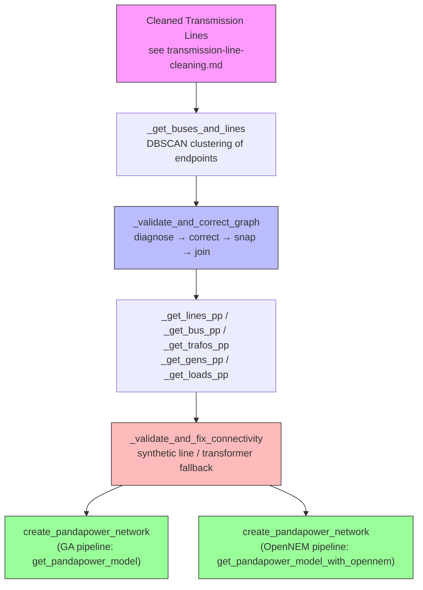
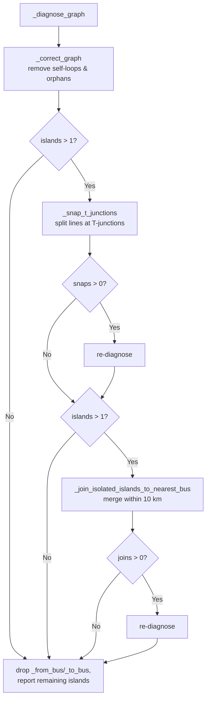
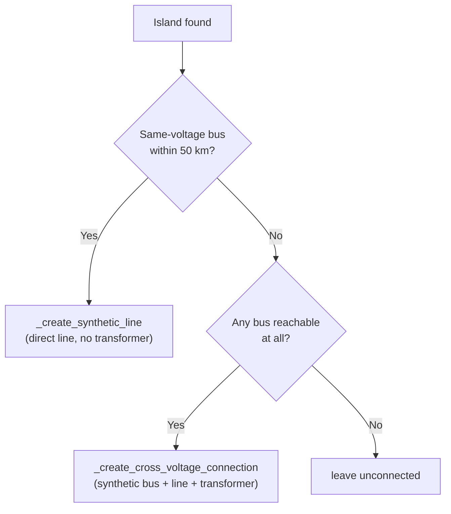

# From Cleaned Geometry to Electrical Model

## Overview

[Transmission Line Cleaning](./transmission-line-cleaning.md) turns raw, broken GIS geometries into continuous `LineString`s. This document picks up from there and explains, step by step, how `nemdb` turns those cleaned lines into a fully-connected electrical network ready for `pandapower`:

1. **Derive a physical bus/line graph** from line endpoints (`_get_buses_and_lines`)
2. **Diagnose and correct connectivity** at the physical level — orphans, self-loops, and islands (`_validate_and_correct_graph`, T-junction snapping, isolated-island joining)
3. **Build the electrical representation** — voltage-specific buses, lines, transformers, generators, loads, slack buses (`get_pandapower_model`)
4. **Fall back to synthetic connections** for any islands that the voltage-specific bus split re-introduces (`_validate_and_fix_connectivity`, run by both pipelines)



---

## Part 1 — Building the Physical Bus/Line Graph

### 1. `_get_buses_and_lines()` — Deriving Buses from Line Endpoints

**Location**: `src/nemdb/models/pandapower/electrical_model.py`

Every transmission line has a `start_point` and `end_point`. Buses don't exist explicitly in the GIS data — they are *inferred* by clustering nearby endpoints together: any two endpoints within `eps` metres are assumed to be the same physical substation.

```python
lines["start_point"] = lines.geometry.map(lambda g: shp.get_point(g, 0))
lines["end_point"] = lines.geometry.map(lambda g: shp.get_point(g, -1))

extremeties = gpd.GeoDataFrame(
    geometry=lines["start_point"].drop_duplicates().to_list()
    + lines["end_point"].drop_duplicates().to_list(),
    crs=lines.crs,
).drop_duplicates()...

fitted_ = DBSCAN(eps=500, min_samples=1).fit(extremeties[["x", "y"]])
extremeties["bus_id"] = "bus_" + fitted_.labels_.astype(str)

buses = extremeties.groupby("bus_id", as_index=False).agg(
    {"geometry": lambda s: shp.centroid(shp.MultiPoint(s))}
)

mapping = extremeties.to_crs(GEO_CRS).set_index("geometry")["bus_id"]
```

**Key points**:

- All clustering happens in `METRIC_CRS` (`EPSG:7856`) so that `eps=500` is a true 500-metre radius.
- A bus's geometry is the **centroid** of all the endpoints clustered into it.
- `mapping` is a `pandas.Series` indexed by `GEO_CRS` (`EPSG:4326`) `Point`s, with `bus_id` strings as values — it is the canonical lookup from "a line endpoint's geographic coordinate" to "the physical bus it belongs to", used throughout the rest of the pipeline.

```text
Before clustering (two endpoints 80 m apart):
   Line A ──●            ●── Line B
            (a)          (b)

After DBSCAN (eps=500m merges a and b):
   Line A ──●────────────●── Line B
                bus_17
```

### 2. `_diagnose_graph()` — Detecting Orphans, Self-Loops, and Islands

**Location**: `src/nemdb/models/pandapower/topology.py`, with helpers `_bus_pair_from_mapping` and `_add_line_edges`

A `networkx.Graph` is built with one node per bus and one edge per line. Two strategies are used to find each line's endpoint buses:

- **Fast path** — if the lines already carry `_from_bus`/`_to_bus` columns (set by `_snap_t_junctions`, see below), use them directly. This avoids re-converting geometries to `GEO_CRS` and is immune to floating-point CRS round-trip mismatches.
- **Standard path** — otherwise convert to `GEO_CRS` and look each endpoint up in `mapping` via `_bus_pair_from_mapping`.

```python
# topology.py — fast path (uses pre-computed _from_bus/_to_bus columns)
if "_from_bus" in lines.columns and "_to_bus" in lines.columns:
    for idx, line in lines.iterrows():
        from_bus, to_bus = line["_from_bus"], line["_to_bus"]
        if from_bus == to_bus:
            self_loops.append(idx)
        else:
            G.add_edge(from_bus, to_bus)
```

`_diagnose_graph` now returns a typed `GraphDiagnostics` dataclass with:

| Field | Meaning |
|-----|---------|
| `orphan_buses` | `list[str]` — buses with degree 0 (no line touches them) |
| `islands` | `list[set[str]]` — connected components, i.e. groups of buses with no path between groups |
| `self_loops` | `list[int]` — indices of lines whose two endpoints map to the same bus |
| `total_buses`, `total_lines` | counts after the current correction pass |
| `n_islands` (property) | `len(islands)` |

> `visualize/island_view.py` has an equivalent `_compute_island_assignment` for rendering — it additionally treats transformers as edges (see [§16](#16-_build_connectivity_graph--voltage-aware-graph) for why that distinction matters).

### 3. `_correct_graph()` — Baseline Corrections

**Location**: `src/nemdb/models/pandapower/topology.py`

Runs first and only handles the *cheap, unambiguous* fixes:

- **Self-loops removed** — a line whose both endpoints clustered into the same bus carries no information and is dropped.
- **Orphan buses removed** — buses with no surviving line are pruned from `buses` and `mapping`.
- **Islands are reported, not fixed** — at this stage the function only logs a warning with island sizes; connecting them is delegated to the next stages.

---

## Part 2 — Physically-Grounded Connectivity Correction

This is the heart of `_validate_and_correct_graph` (`topology.py`), whose docstring lays out the exact sequence:

```text
1. No orphan buses (buses with no line connections)
2. No self-loops (lines with same start and end bus)
3. Snaps T-junction islands to line interiors where possible
4. Joins remaining small islands (e.g. broken-geometry orphan lines) to
   the nearest bus in the main network, within a 10 km radius
5. Reports remaining islands for correction at model level
```



### 4. `_snap_t_junctions()` / `_apply_t_snap()` — T-Junction Snapping

**Location**: `src/nemdb/models/pandapower/topology.py` (`_snap_t_junctions` orchestrates; `_apply_t_snap` executes one snap)

DBSCAN only merges endpoints that lie close to **other endpoints**. It misses the common "T-junction" case: a line's endpoint sits close to the *interior* of another line (a tee/spur connecting mid-span), which produces an isolated single-line island.

```text
Before snapping — tee line is an isolated island:

    Main line  A ════════════●═══════════ B
                              ╲
                               ╲ (endpoint ~1.5 km from
                                ╲ the interior of A–B,
                                 ● too far for DBSCAN's 500 m)
                              Tee line (island)

After snapping — A–B is split at the projection point and
the tee's endpoint bus is merged into the new split bus:

    Main line  A ════●════════●═══════════ B
                      (split)  ╲
                       bus      ╲
                                 ●
                              Tee line (now connected)
```

**Algorithm** (per island, largest-first):

1. Pre-compute `_from_bus`/`_to_bus` for every line in one batch CRS conversion — this both speeds up later lookups and is what enables `_diagnose_graph`'s fast path.
2. For each bus in the island, build a `max_snap_distance_m`-radius buffer around it and query the lines spatial index for candidates (`lines.sindex.query(buffer, predicate="intersects")`).
3. For each candidate line **not belonging to the same island**:
   - Project the bus onto the line: `t = line_geom.project(bus_geom)`.
   - **Skip endpoint hits** — `t <= 1.0` or `t >= line_geom.length - 1.0` — those are DBSCAN's job.
   - Compute `dist = bus_geom.distance(line_geom.interpolate(t))` and keep the closest candidate found so far.
4. If the best candidate is within `max_snap_distance_m`, split it with `shapely.ops.substring(geom, 0, t)` / `substring(geom, t, length)`, create a new bus at the split point (`old_geom.interpolate(t)`), and remap the island's bus to that new bus.
5. **Reuse an existing bus** if one already sits at the split point (e.g. the line passes through an existing substation) — this avoids ambiguous duplicate `mapping` entries.
6. Reject **degenerate splits** — segments shorter than 1 m.
7. One snap is performed per island per pass; islands are then re-diagnosed because a snap can cascade (merging two islands at once).

```python
# _apply_t_snap — the core projection/skip/distance logic
t = line_geom.project(bus_geom)
if t <= 1.0 or t >= line_geom.length - 1.0:
    continue
dist = bus_geom.distance(line_geom.interpolate(t))
if dist < best_dist:
    best_dist, best_line_iloc, best_t = dist, iloc, t
```

> **Note on transformers**: a snap never needs to create a transformer itself — `_get_trafos_pp` (see [§9](#9-_get_trafos_pp--auto-creating-transformers)) automatically creates one wherever the resulting physical bus carries lines of different `capacitykv`.

#### Worked example: Laguna Keys to Tee

The "Laguna Keys to Tee" line was an isolated single-line island whose endpoint sits **1,494 m** from the interior of the "Proserpine to Mackay" line — beyond the original `max_snap_distance_m=500.0` default (chosen to mirror DBSCAN's `eps`), but well inside a more generous radius. The nearest *bus* (as opposed to line interior) was ~19.5 km away — too far for the join step described next. Raising the default to **2,000 m** brought this case within range without affecting any other island (verified by checking that no other remaining island had a snap candidate between 500 m and 2,000 m): island sizes went from `[1660, 12, 2]` to `[1660, 12]`.

### 5. `_join_isolated_islands_to_nearest_bus()` — Joining Remaining Islands

**Location**: `src/nemdb/models/pandapower/topology.py`

Some islands are caused by lines with **broken or inaccurate geometry** whose endpoints sit far from any line's interior — `_snap_t_junctions` finds no candidate to split. Rather than leaving these disconnected, this step performs a pure **bus merge**: it finds the closest bus pair (one inside the island, one outside) within `max_join_distance_m=10_000.0` (10 km) and remaps the island bus onto the external one.

```python
# topology.py — bus merge after nearest_bus_pair finds the closest cross-island pair
graph.mapping = graph.mapping.where(graph.mapping != src_id, cand_id)
for col in ("_from_bus", "_to_bus"):
    if col in graph.lines.columns:
        graph.lines[col] = graph.lines[col].where(graph.lines[col] != src_id, cand_id)

graph.buses = graph.buses[graph.buses["bus_id"] != src_id].reset_index(drop=True)
```

Crucially, **no geometry is created or moved** — this is a topological merge only (`mapping`/`_from_bus`/`_to_bus` are remapped; the island bus row is dropped). It physically connects the island for graph-traversal and electrical-modelling purposes, but the original line `geometry`/`geodata` still ends at the old (now-merged-away) location.

> **Why merged islands can show a visual gap**: `visualize/network_view.py:_add_lines_to_figure` renders each line by reading its stored `geodata` coordinate list directly — it has no notion of the post-merge `bus_id` remap. So a line whose endpoint bus was merged into another bus 10 km away still draws to its *original* coordinate, appearing to "float" near, but not touching, the bus it is now topologically connected to. `_snap_t_junctions` avoids this because it actually **splits line geometry** at the connection point — there is no equivalent geometry creation in the join step, by design (it exists specifically for cases where the underlying geometry is too broken to trust).

This was observed concretely with the three two-bus islands flagged by the user as "orphaned lines with broken geometry" — each was merged into the nearest bus within the 10 km radius, reducing the remaining island count from 3 small islands to effectively 0 after the full pipeline.

### 6. Putting It Together — `_validate_and_correct_graph()`

**Location**: `src/nemdb/models/pandapower/topology.py`

```python
def _validate_and_correct_graph(graph: PhysicalGraph) -> tuple[PhysicalGraph, CorrectionStats]:
    diagnostics = _diagnose_graph(graph)
    graph, stats = _correct_graph(graph, diagnostics)

    if stats.islands_remaining > 1:
        islands_sorted = sorted(diagnostics.islands, key=len, reverse=True)
        graph, snaps = _snap_t_junctions(graph, islands_sorted)
        if snaps > 0:
            diagnostics = _diagnose_graph(graph)
            stats.islands_remaining = diagnostics.n_islands
            islands_sorted = sorted(diagnostics.islands, key=len, reverse=True)

        if stats.islands_remaining > 1:
            graph, joins = _join_isolated_islands_to_nearest_bus(graph, islands_sorted)
            if joins > 0:
                diagnostics = _diagnose_graph(graph)
                stats.islands_remaining = diagnostics.n_islands

        graph.lines = graph.lines.drop(columns=["_from_bus", "_to_bus"], errors="ignore")

    return graph, stats
```

The temporary `_from_bus`/`_to_bus` columns on `graph.lines` exist purely to make the snap/join/re-diagnose loop fast and CRS-mismatch-proof; they're dropped before the corrected `graph.lines`/`graph.buses`/`graph.mapping` are returned to `_get_buses_and_lines`, which unpacks them and logs a final summary before handing off to the electrical-model build.

---

## Part 3 — Building the Electrical (pandapower) Representation

**Entry point**: `get_pandapower_model()` (`src/nemdb/models/pandapower/electrical_model.py`)

```python
lines, buses, mapping = _get_buses_and_lines()
pf_lines  = _get_lines_pp(lines, mapping)
pf_buses  = _get_bus_pp(pf_lines, buses)
pf_trafos = _get_trafos_pp(pf_buses)
pf_gens   = _get_gens_pp(pf_buses)
pf_loads  = _get_loads_pp(pf_buses)
```

A second entry point, `get_pandapower_model_with_opennem()` (also in `electrical_model.py`), reuses the exact same pipeline but swaps `_get_gens_pp` for `_get_gens_from_opennem` (matched OpenNEM facilities instead of GA major-power-station data). Both pipelines run `_validate_and_fix_connectivity` — see [Part 4](#part-4--model-level-connectivity-fallback).

### 7. `_get_lines_pp()` — Lines with Voltage-Suffixed Bus IDs

**Location**: `src/nemdb/models/pandapower/electrical_model.py`

Each cleaned `lines` row is converted to a pandapower-shaped record. The crucial step: **the physical `bus_id` is suffixed with its line's voltage**, e.g. `bus_42` carrying a 220 kV line becomes endpoint `bus_42_220kv`.

```python
df["from_bus"] = df["from_bus"] + "_" + df["voltagekv"].astype(str) + "kv"
df["to_bus"]   = df["to_bus"]   + "_" + df["voltagekv"].astype(str) + "kv"
```

This is what creates **voltage-specific buses** — see next section. `name`, `length_km`, `in_service` (`operationalstatus == "Operational"`), `class`, and full-geometry `geodata` (for plotting) are carried straight from the GIS line. Self-loops (`from_bus == to_bus`) are dropped a second time here as a safety net.

### 8. `_get_bus_pp()` — One Pandapower Bus per (Physical Bus, Voltage)

**Location**: `src/nemdb/models/pandapower/electrical_model.py`

Pandapower buses are derived **from the line endpoints**, not directly from the `buses` GeoDataFrame — a physical substation that carries lines of two different voltages becomes **two** pandapower buses (`bus_42_220kv` and `bus_42_330kv`):

```python
pf_buses = (
    pd.concat((pf_lines[["from_bus", "voltagekv"]].rename(columns={"from_bus": "bus"}),
               pf_lines[["to_bus",   "voltagekv"]].rename(columns={"to_bus":   "bus"})))
    .drop_duplicates()
    .rename(columns={"voltagekv": "vn_kv", "bus": "bus_id"})
)
pf_buses["geodata"] = (
    pf_buses["bus_id"].str.rsplit("_", n=1, expand=True)[0]   # strip the "_220kv" suffix
    .map(buses.to_crs(GEO_CRS).set_index("bus_id")["geometry"].to_dict())
)
```

`vn_kv` (nominal voltage) comes from the suffix; `geodata` is looked up from the *physical* bus (suffix stripped) so all voltage-variants of the same substation share one geographic location; `in_service` is always `True`.

### 9. `_get_trafos_pp()` — Auto-Creating Transformers

**Location**: `src/nemdb/models/pandapower/electrical_model.py`

The rule is simple and entirely derived from the bus-naming scheme above: **whenever the same physical-bus prefix appears with more than one voltage suffix, a transformer is created chaining each consecutive pair of (sorted) voltages**:

```python
gdf = (pf_buses["bus_id"].str.rsplit("_", n=1, expand=True)
       .set_axis(["bus_id", "vn_kv"], axis=1)
       .groupby("bus_id").agg(lambda s: sorted(s.str.replace("kv", "").astype(int))))
gdf = gdf[gdf["vn_kv"].map(len) > 1]

for lv, hv in zip(row["vn_kv"][:-1], row["vn_kv"][1:], strict=False):
    trafos.append({"lv_bus": f"{bus}_{lv}kv", "hv_bus": f"{bus}_{hv}kv",
                   "vn_lv_kv": lv, "vn_hv_kv": hv,
                   "sn_mva": 1_000, "vk_percent": 12.2, "vkr_percent": 0.25,
                   "pfe_kw": 60.0, "i0_percent": 0.06, "in_service": True})
```

E.g. a substation with 132/220/330 kV lines produces two transformers: 132↔220 and 220↔330. The electrical parameters (`sn_mva`, `vk_percent`, `vkr_percent`, `pfe_kw`, `i0_percent`) are **placeholder values** — the source code marks them `# ARBITRARY VALUES TODO find acceptable values` since the GIS data carries no transformer ratings.

### 10. `_get_gens_pp()` / `_get_gens_from_opennem()` — Attaching Generators

**Location**: `src/nemdb/models/pandapower/electrical_model.py`

Both variants attach generation facilities to the **nearest** pandapower bus via `gpd.sjoin_nearest` (no voltage matching is enforced — generators connect at whatever bus is geographically closest):

| | GA pipeline (`_get_gens_pp`) | OpenNEM pipeline (`_get_gens_from_opennem`) |
|---|---|---|
| Source | `read_major_powerstations()` | `match_facilities_to_gis()` |
| Capacity field | `generationmw` | `capacity_registered_mw` |
| Status filter | `operationalstatus == "Operational"` | `status_id == "operating"` |
| Dedup key | `[name, max_p_mw]` | `[code]` |

In both cases `p_mw = capacity / 2` (a 50%-of-capacity operating-point assumption) and `max_p_mw = capacity`.

### 11. `_get_loads_pp()` — Attaching Substations as Loads

**Location**: `src/nemdb/models/pandapower/electrical_model.py`

Substations from `read_substations()` are attached the same way — nearest-bus spatial join — but **with an additional voltage-matching filter** that generators don't have:

```python
.query("voltagekv == vn_kv")
```

This is stricter because a substation genuinely operates at a specific declared voltage, whereas a generator's connection voltage is less reliably recorded in the GIS dataset. Loads are created with `p_mw=0` (placeholders representing connection points, not real demand).

### 12. Line Electrical Parameters — `_LINE_PARAMS`

**Location**: `src/nemdb/models/pandapower/line_params.py`, used by `_add_lines_to_network` in `network_builder.py`

The GIS data carries no per-line impedance values, so `nemdb` uses a **voltage-keyed lookup table** of approximate standard parameters:

| Voltage (kV) | r (Ω/km) | x (Ω/km) | c (nF/km) | max I (kA) |
|---|---|---|---|---|
| 500 | 0.02 | 0.28 | 12.0 | 3.0 |
| 330 | 0.03 | 0.32 | 11.0 | 2.0 |
| 275 | 0.04 | 0.33 | 11.0 | 1.5 |
| 220 | 0.06 | 0.37 | 10.0 | 1.0 |
| 132 | 0.10 | 0.40 | 9.0 | 0.6 |
| 110 | 0.12 | 0.42 | 9.0 | 0.5 |
| 66  | 0.18 | 0.44 | 8.0 | 0.4 |
| *other* | 0.10 | 0.40 | 9.0 | 0.6 (`_DEFAULT_LINE_PARAMS`) |

There is no per-line variation by conductor type or circuit count — every line at a given voltage gets identical impedance.

### 13. `_add_external_grids()` — Slack Buses

**Location**: `src/nemdb/models/pandapower/network_builder.py`

Five major NEM interconnection substations are hard-coded as slack buses (`vm_pu=1.0`, `va_degree=0.0`):

| Substation | Voltage | State |
|---|---|---|
| Torrens Island A | 275 kV | South Australia |
| Thomastown | 220 kV | Victoria |
| George Town | 220 kV | Tasmania |
| Sydney West | 330 kV | New South Wales |
| South Pine | 275 kV | Queensland |

Each is matched by **case-insensitive substring search** against load names already created by `_get_loads_pp` (`net.load["name"].str.contains(sub_name, case=False)`), then a `pp.create_ext_grid` is attached to that load's bus. If a substation can't be found — e.g. it ended up in a disconnected island — it's skipped with a debug log, not an error.

### 14. Final Assembly — `create_pandapower_network()`

**Location**: `src/nemdb/models/pandapower/network_builder.py`, with helpers `_add_buses_to_network`, `_add_lines_to_network`, `_add_transformers_to_network`, `_add_generators_to_network`, `_add_loads_to_network`

Orchestrates the actual `pandapower.auxiliary.pandapowerNet` construction in order: buses → lines → transformers → generators → loads → external grids → `sanity_checks()`. Bus `geodata` is stored as `(lat, lon)` tuples for plotting. All five `_add_*_to_network` helpers use pandapower's bulk creation APIs (`pp.create_buses`, `pp.create_lines_from_parameters`, etc.) rather than per-row calls.

---

## Part 4 — Model-Level Connectivity Fallback

### 15. Why It Still Exists

Splitting physical buses into voltage-specific buses (Part 3, step 8) can **re-introduce** islands that didn't exist at the physical level: a substation that is physically connected to the rest of the network only through, say, its 132 kV side, but also hosts an isolated 22 kV bus with no same-voltage line back to the main grid, becomes an island purely as an artefact of the voltage-specific representation. The physically-grounded fixes from Part 2 cannot — and should not — fix this, because there is no real T-junction or geometry error to correct; the "island" only exists once voltage levels are treated as separate layers.

`_validate_and_fix_connectivity` is therefore a **deliberate last-resort fallback**, applied by **both** pipelines — `get_pandapower_model()` and `get_pandapower_model_with_opennem()` both call it after building the voltage-split model, for the same reason (both can produce voltage-level islands that don't exist at the physical level).

### 16. `_build_connectivity_graph()` — Voltage-Aware Graph

**Location**: `src/nemdb/models/pandapower/connectivity_fallback.py`

Unlike the GIS-level `_diagnose_graph`, this graph includes **transformer edges** (`hv_bus`↔`lv_bus`) alongside line edges, plus isolated generator/load buses as standalone nodes — because at this level, a transformer is a legitimate connection between two voltage-specific buses representing the same physical substation.

### 17. `_find_closest_bus_pair()` — Vectorized Nearest-Pair Search

**Location**: `src/nemdb/models/pandapower/connectivity_fallback.py`

Finds the closest bus pair between an island and the main network. Optionally restricts candidates to `same_voltage` matches first, then delegates the spatial search to `geo_utils.nearest_bus_pair` (a vectorized `geopandas.sjoin_nearest` call) after converting the plain DataFrames to GeoDataFrames in `METRIC_CRS`. Returns `(src_bus_id, cand_bus_id, distance_km)`.

### 18. `_connect_islands()` — Two-Strategy Orchestration

**Location**: `src/nemdb/models/pandapower/connectivity_fallback.py`



- **Strategy 1 — same voltage, `MAX_SAME_VOLTAGE_DISTANCE = 50.0` km**: `_create_synthetic_line` draws a direct line at the island's voltage, named `Synthetic_{island_bus}_to_{main_bus}`, `class="Synthetic Connection"`, length = great-circle distance between the two buses.
- **Strategy 2 — cross-voltage, unrestricted distance**: `_create_cross_voltage_connection` builds a **three-part bridge** to respect pandapower's "lines must connect same-voltage buses" constraint:
  1. A synthetic intermediate bus at the **island's** voltage, geographically located at the **main** bus
  2. A same-voltage synthetic line: island bus → intermediate bus
  3. A synthetic transformer: intermediate bus ↔ main bus (orientation chosen so `vn_lv_kv < vn_hv_kv`)

```text
bus_474_220kv ──[line @ 220kV]── bus_1700_synthetic_220kv ──[transformer 220↔66]── bus_600_66kv
     island                          intermediate (located                              main
   (220 kV)                           at main bus, 220 kV)                           (66 kV)
```

Both synthetic line and synthetic transformer use the **same placeholder electrical parameters** as `_get_trafos_pp` (`sn_mva=1_000`, `vk_percent=12.2`, `vkr_percent=0.25`, `pfe_kw=60.0`, `i0_percent=0.06`).

### 19. `_validate_and_fix_connectivity()` — Iteration

**Location**: `src/nemdb/models/pandapower/connectivity_fallback.py`

Runs `_connect_islands` for up to `max_iterations=5` passes, re-building the connectivity graph each time — connecting one island can split or merge others, so the process repeats until a single connected component remains or no further connection is possible.

### How to Recognise Synthetic Elements

Any element with `class == "Synthetic Connection"` or a name starting with `Synthetic_` was added by this fallback, **not** derived from GIS data — treat long synthetic connections (e.g. >100 km) as a signal of regional voltage-level isolation or GIS data gaps rather than real infrastructure.

---

## Configuration Parameters

| Parameter | Value | Location | Purpose |
|---|---|---|---|
| `eps` (DBSCAN) | 500 m | `electrical_model.py:_get_buses_and_lines` | Cluster line endpoints into physical buses |
| `max_snap_distance_m` | 2,000 m | `topology.py:_snap_t_junctions` | Max distance to attempt a T-junction snap |
| degenerate-segment guard | 1 m | `topology.py:_apply_t_snap` | Reject splits producing near-zero-length segments |
| `max_join_distance_m` | 10,000 m | `topology.py:_join_isolated_islands_to_nearest_bus` | Max distance to merge an island bus into the nearest external bus |
| `MAX_SAME_VOLTAGE_DISTANCE` | 50 km | `connectivity_fallback.py:_connect_islands` | Preferred (no-transformer) island-connection radius, model level |
| transformer placeholder params | `sn_mva=1000`, `vk_percent=12.2`, `vkr_percent=0.25`, `pfe_kw=60.0`, `i0_percent=0.06` | `electrical_model.py:_get_trafos_pp`, `connectivity_fallback.py:_create_cross_voltage_connection` | Used for both auto-created and synthetic transformers (TODO: replace with realistic values) |
| `_LINE_PARAMS` | voltage-keyed r/x/c/max_i table | `line_params.py` | Approximate line electrical parameters (GIS data lacks impedance) |

## Common Edge Cases

| Case | Handling |
|---|---|
| T-junction snap point coincides with an existing bus | Reuse that bus instead of creating a duplicate `mapping` entry (`_apply_t_snap` in `topology.py`) |
| Split would produce a segment < 1 m | Reject and try the next-best candidate (`_apply_t_snap` returns `None`) |
| Island bus has no snap candidate within `max_snap_distance_m` | Falls through to `_join_isolated_islands_to_nearest_bus` |
| Island has no join candidate within `max_join_distance_m` either | Remains an island; reported in final diagnostics, resolved by the model-level fallback (both pipelines) |
| Voltage-specific bus splitting re-isolates a physically-connected substation | Resolved by `_validate_and_fix_connectivity`'s same-voltage-then-cross-voltage synthetic fallback (both pipelines) |
| Self-loop lines (both endpoints cluster to the same bus) | Removed at two points: `_correct_graph` (physical level) and `_get_lines_pp` (electrical level) |

## Visualizing the Result

Topological merges (T-snap and island-join) update `bus_id`/`mapping` but the join step deliberately leaves line geometry untouched — see [§5](#5-_join_isolated_islands_to_nearest_bus--joining-remaining-islands) for why a recently-joined island can appear visually disconnected from the bus it is now wired to in `visualize/network_view.py`'s rendering, even though the electrical model treats it as connected.

## Related Documentation

- [Transmission Line Cleaning](./transmission-line-cleaning.md) — how raw GIS geometries are validated and fixed before this pipeline runs
- [Build a Network Model](../tutorials/build-network-model.md) — tutorial walking through the full pipeline end to end
